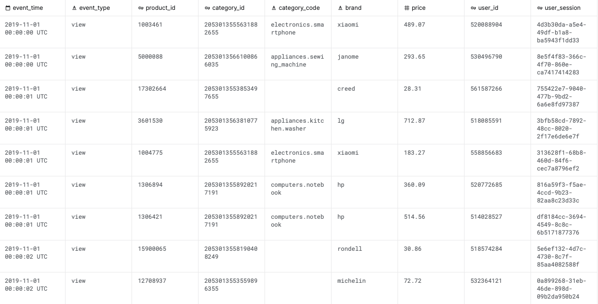

# Customer Retention Prediction
TL;DR
(project goal, context, data, model, result)

# Introduction

## Motivation
- A key to a company's growth is its **ability to keep customers** 
  - Keeping existing customers is more cost efficient than acquiring new ones
  - It speaks about brand attractiveness and customer experience 
- In the context of e-commerce, i.e., non-subscription based business, customer retention = **repeated visits from the same customer**
  -  Relevant questions to ask are how far apart visits need to be for a user to be considered as a returning user, and what events should be deemed as _visits_
  -  It is worth noting that the answers to these questions, and even the definition of customer retention, can vary across businesses
- Knowing if a customer will return is valuable
  - Help to distinguish different types of shoppers and understand their needs
  - Allow preemptive measures to prevent churns
  - An effective way to evaluate if a marketing campaign or a sale event is successful

## Case background
- The subject of study is an online retailer of multi-category consumer goods with a pseudonym *PrimeBuy*
- Primary data is user activities on PrimeBuy 
  - Collected by [Open CDP](https://rees46.com/en/open-cdp) project and available on [Kaggle](https://www.kaggle.com/mkechinov/ecommerce-behavior-data-from-multi-category-store)
  - More details to be discussed below
- Focal interests of study
  - How to measure customer retention of PrimeBuy
  - What can customer activities tell about retention
  - Any value-adding opportunities and strategies

## Data
- Activity level data with each row representing a user's activity (such as view) on a certain product and the corresponding timestamp
- Restricted to user activities between Oct 2019 and Mar 2020. 286 million rows (44GB+)
- Nine columns:
  - *Event_time*: Timestamp of a user activity in UTC
  - *Event_type*: Type of activities. Either view, cart, or purchase. About 94% are view, 4% cart and 2% purchase
  - *Product_id*: Unique identifier of a product
  - *Category_id*: Unique identifier of a category of products
  - *Category_code*: Category name if available. About 24% are missing. Most popular non-missing category is electronics-smartphone (16%)
  - *Brand*: Brand name of a product if available. About 13% are missing
  - *Price*: Product price. Average product price is $174
  - *User_id*: Unique identifier of a user
  - *User_session*: Temporary user session ID. Will change whenever users switch devices, log off and on, or have a long pause between activities

## Objective
The model objective is formulated as:   

_**Predict if customers who visited in 2019 Q4 would also visit in 2020 Q1**_

- Using the quarterly interval to discuss customer retention better suits the business nature of PrimeBuy whose products are mainly slow-moving and seasonal electonics and appliances
- _Visit_ comprises all user activities, i.e. view, cart, and purchase. It is not restricted to purchase only because:
  - From the data perspective, only a tiny portion of activities are purchase, and no enough information about why the conversion is so low from view to buy. It could be due to a long time gap, uncompetitive prices, or other reasons. Restricting to purchase only could distort the analysis
  - From the business perspective, looking at all activities tells about brand awareness and customer activeness which generates more long-term benefits than purchases alone
- Because 2019 Q4 is also holiday season, this study can also serve as a retrospective analysis on the effectiveness of holiday promotions if any

